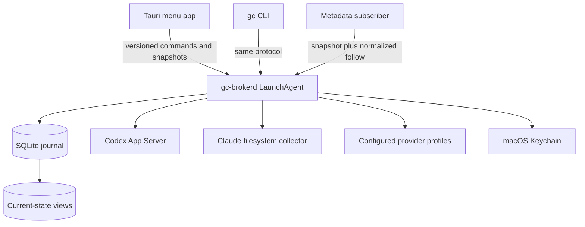
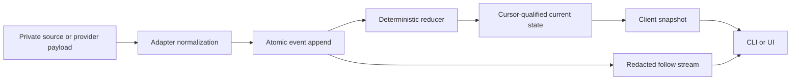
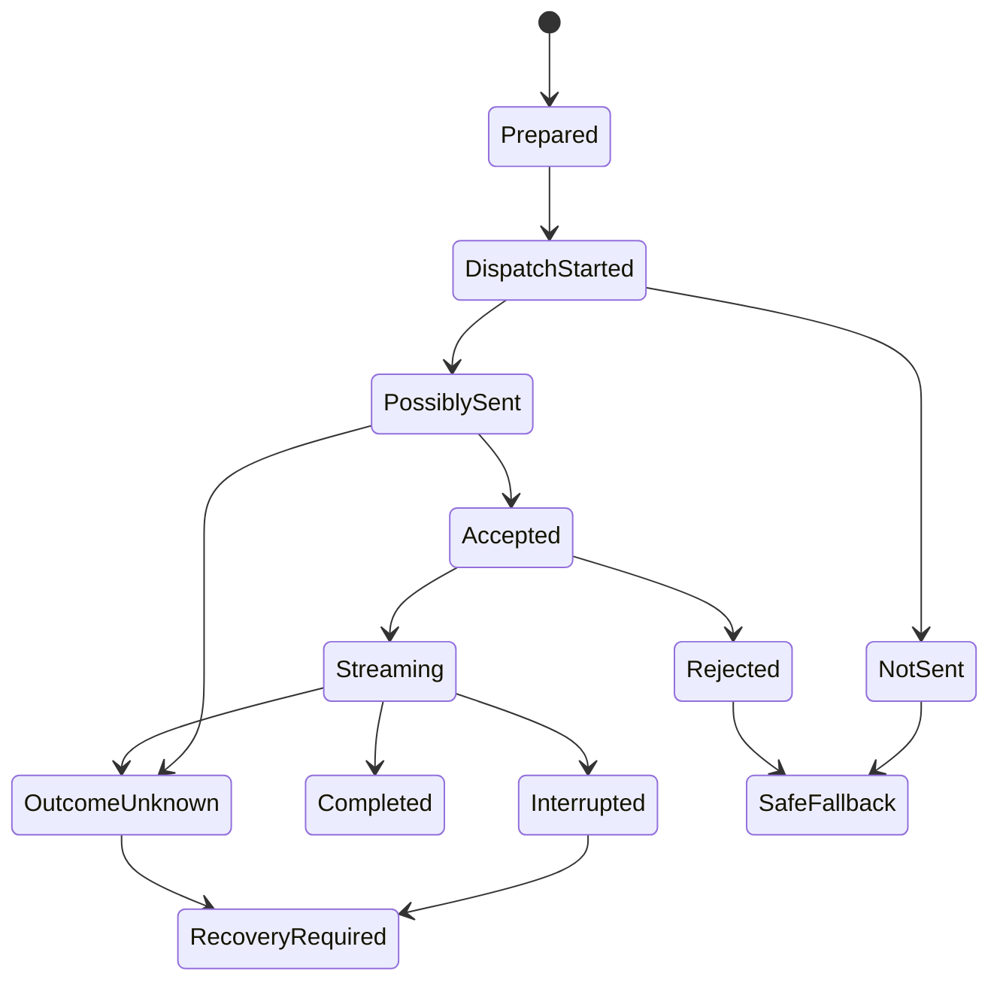
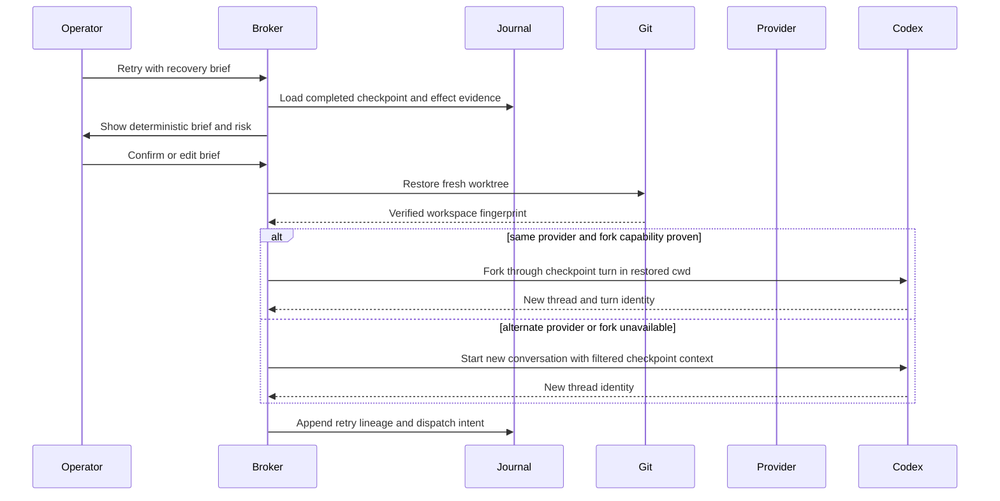

# Managed Agent Control Plane - Plan

## Goal Capsule

- **Objective:** Turn Ground Control from a Claude-only observer into a local control plane that can launch, monitor, control, recover, and verify managed Codex work while preserving the existing observation surface.
- **Authority hierarchy:** This plan overrides the stale product boundary in `docs/spec.md`; runtime capability evidence overrides assumptions about an installed agent version.
- **Execution profile:** Deliver the work as separately tracked U-ID packages. Each package must leave the repository buildable and record its own acceptance evidence before a dependent package starts; protocol/daemon, Tauri service integration, read-only UI, and mutating UI controls remain separate contexts.
- **Stop conditions:** Stop if a migration can destroy existing local data, if an adapter cannot distinguish a safe retry from an ambiguous dispatch, or if an implementation would present same-user workflow controls as a hard security boundary.
- **Tail ownership:** The implementation owner carries each package through tests, documentation, and its tracker handoff. Production signing and notarization may require operator-provided Apple credentials, but the unsigned development proof remains part of the implementation.

---

## Product Contract

### Summary

Ground Control will own durable local orchestration for managed agent work through a persistent per-user service. The service will keep a private event journal, derive cursor-qualified current-state views, expose the same headless controls to the CLI and desktop app, and record evidence needed to resume or retry work without claiming that external side effects were rolled back.

The first managed adapter is Codex App Server. Existing Claude Code sessions remain supported as observed sessions while their ingestion path is hardened and moved behind the same service boundary.

### Problem Frame

The current application is an observer whose CLI and Tauri process independently read Claude files, start file watchers, and access an aggregate SQLite cache. That shape cannot safely own autonomous runtimes: there is no single writer, durable command intent, failure certainty, capability contract, crash reconciliation, checkpoint, side-effect record, or acceptance evidence.

Service interruptions are especially costly. A request may fail before dispatch, disappear after partial transmission, stream only part of a response, or continue inside a provider retry loop. Ground Control must preserve that uncertainty, prevent duplicate work, and offer recovery from the last safe boundary.

### Vocabulary

- **Work unit:** The operator's durable objective and acceptance policy.
- **Attempt:** One execution of a work unit on a specific runtime, provider, host, and isolated workspace.
- **Turn:** One provider-recognized user-to-agent interaction inside an attempt.
- **Event journal:** Append-only, private operational history with a monotonic journal sequence, immutable event schema, and source provenance.
- **Current-state view:** State deterministically reduced from journal events through a committed journal sequence and reducer version. It is not a claim of instantaneous global truth.
- **Cursor:** A namespaced position. Source cursors identify source generation and byte span/hash; journal sequences order canonical events; view cursors bind applied journal sequence to reducer version; subscriber cursors track delivery.
- **Fixture replay:** Feeding scrubbed static provider or collector records through the real ingestion and reducer path, then comparing canonical events and current-state output with expected results.
- **Checkpoint:** A completed-turn boundary that binds conversation state, journal cursor, workspace fingerprint, runtime/config fingerprint, and known side effects.
- **Recovery brief:** Deterministic guidance for a new turn or attempt that distinguishes confirmed, attempted, and unknown real-world effects.
- **Evidence:** A provenance-bearing observation or verification item. An agent's final message is evidence, but is not by itself proof that the work unit passed acceptance.

### Actors

- A1. The operator creates work, configures policy, resolves approvals, and accepts recovery risk.
- A2. `gc-brokerd` owns runtimes, journal writes, current-state reduction, policy, and mutation authorization.
- A3. A managed runtime adapter translates provider-specific lifecycle and capability behavior.
- A4. CLI and Tauri clients inspect state and issue authorized commands through one broker protocol.
- A5. Read-only subscribers consume normalized, sensitivity-filtered state and evidence events.
- A6. Legacy collectors translate Claude filesystem observations into canonical observed-session events.

### Requirements

**Authority, data, and migration**

- R1. Ground Control must distinguish managed, cooperative, and observed sessions without presenting observed PIDs as controllable.
- R2. `gc-brokerd` must be the sole owner of journal writes, runtime processes, source cursors, current-state updates, and mutating controls.
- R3. A new authoritative SQLite database must store an append-only application journal and rebuildable current-state views through ordered, transactional migrations; the legacy `index.db` remains a disposable read-only import source until explicit retirement.
- R4. Each immutable event must carry a monotonic journal sequence, registered payload schema version, provider/source identity, correlation and causation IDs, sensitivity, and source/observed/persisted timestamps; event changes append new events and reducers expose their version.
- R5. Default protocol DTOs must be explicit metadata/evidence-summary allowlists. V1 exposes no client operation for raw frames, full messages, tool arguments, patches, or receipts; unavoidable managed-runtime raw content remains in a broker-internal store after credential redaction.
- R6. Existing aggregate session rows must remain labeled legacy observations or be rebuilt from retained source files; they must never be converted into fabricated turn events or verified evidence.
- R7. Current-state responses must atomically name the applied journal sequence, reducer version, freshness, liveness, degradation, and action availability used to derive them.

**Protocol and control**

- R8. CLI and Tauri must use one size- and time-bounded broker protocol with snapshot-at-view-cursor, inclusive journal follow semantics, deduplication, connection quotas, bounded subscriber buffers, and explicit protocol, compatibility, degradation, or cursor errors.
- R9. The broker must derive principal and role from the authenticated connection. Every mutation must include a client-generated idempotency key and expected state/attempt/turn revision, while idempotency results are scoped to principal, method, target, and request-body hash.
- R10. The broker must separate metadata-reader, authorized-operator, and managed-child principals and derive roles from authenticated connections. The first headless slice gives managed App Server children no broker access. A later feature that requires child access must first define an audience-bound credential, safe delivery, replay resistance, expiry, and revocation while keeping credentials and privileged descriptors outside worktrees and inherited runtime state.
- R11. Autonomous execution must remain the default policy posture while exact runtime-raised approvals, steer, interrupt, cancel, resume, retry, and status inspection remain available to the operator.
- R12. Work-unit cancellation must stop future scheduling, expire pending approvals, interrupt active work, supervise process exit, and retain uncertainty if acknowledgement is missing.

**Managed Codex and capabilities**

- R13. The first managed adapter must use the installed Codex App Server to launch and map work unit, attempt, process, thread, turn, and approval identities.
- R14. Capability resolution must combine adapter schema support, installed runtime version, live provider introspection, plugin/hook inventory, model-provider capabilities, sandbox/policy, ownership, and current turn state.
- R15. Every action must distinguish “runtime supports this” from “available now” and provide a machine-readable disabled reason, human-readable explanation, remediation, and revision-conflict behavior shared by CLI and desktop.
- R16. Plugin inventory is read-only in the first slice; missing prerequisites may produce an exact installation proposal, but no plugin is installed silently or as a side effect of negotiation.

**Failure, providers, and recovery**

- R17. The lifecycle must separately record broker-to-runtime command dispatch and runtime-to-LLM request phase. Provider-level `not_sent`, possibly-sent, accepted, streaming, completed, interrupted, rejected, and outcome-unknown states require provider/runtime evidence, certainty, and source.
- R18. Provider-native retry state must take precedence over GC fallback, and user cancellation must take precedence over all retry or fallback automation.
- R19. Provider configuration must bind an explicitly approved canonical origin and support explicit URLs plus suggested same-host Ollama and LM Studio defaults; discovery is unauthenticated, bounded, redirect-safe, and creates candidates rather than enabled fallback targets.
- R20. Credentials must live in macOS Keychain behind origin-bound opaque references and be decrypted only for a named adapter operation. Plaintext must not enter argv, serialized config, tool/acceptance environments, journals, logs, diagnostics, evidence, or recovery briefs; runtime-exposed delivery requires explicit enablement.
- R21. Automatic fallback may create a new attempt only after a terminal failure, an eligible capability preflight, and a safe checkpoint; ambiguous or interrupted work must never be replayed blindly.
- R22. The first managed attempt and every retry must use an isolated Git worktree created from a verified workspace seed that does not modify the source checkout. Unsupported, dirty-unbounded, or oversized state must disable automatic retry and retain manual guidance.
- R23. Same-attempt resume is permitted only when thread, workspace, runtime, config, and instruction fingerprints still match an unambiguous resumable state.
- R24. “Retry with recovery brief” must bind generated facts and confirmation to the latest evidence decision cursor, restore a verified filesystem checkpoint, preserve the failed worktree, and require acknowledgement when effects are unknown or unsafe. Same-provider retry may fork through the checkpoint turn when capability-proven; alternate-provider fallback starts a new conversation with a sensitivity-filtered brief.
- R36. Ground Control's journal must remain the durability authority. Workflow steps require stable identities, reducer-derived eligibility, durable due times, and separate intent, dispatch-started, acknowledgement, and outcome states; restart may safely dispatch an eligible unstarted step but must quarantine a started step whose outcome cannot be proven rather than replaying it.

**Evidence, acceptance, and UI**

- R25. Each turn and attempt must retain evidence envelopes for terminal runtime status, minimal final response when present, tool results, repo state, external receipts, token usage, checkpoints, and acceptance gates.
- R26. Side effects must append intent before dispatch and later acknowledgement, confirmation, failure, or unknown events together with reversibility and repeatability; retry eligibility must revalidate the latest effect revision before dispatch.
- R27. Turn completion, attempt completion, acceptance verification, and work-unit completion must remain independent states.
- R28. Acceptance definitions must be operator-authored, revision-bound, and stored outside mutable repository content. Automated runners require a sanitized, bounded, worktree-confined environment with no provider secret, Keychain, broker socket, or lingering process access; otherwise acceptance remains operator-triggered and potentially side-effecting.
- R29. The first UI must provide an attention-oriented mission board and work-unit detail with deterministic attention ranking, explicit managed/cooperative/observed treatment, runtime state, freshness, capabilities, usage, optional budget, acceptance, checkpoint, evidence, side-effect safety, fallback, and available controls.
- R30. Token budgets must be nullable, advisory, and provenance-qualified; missing usage must remain unknown and must not block launch, recovery, or acceptance.
- R35. Private storage must expose operator-visible size and health, support an explicit stop-and-purge operation that preserves non-sensitive audit tombstones, and fail closed before new external dispatch when durable storage is unavailable or over its configured limit.

**Compatibility, security, and quality**

- R31. Legacy Claude ingestion must honor `CLAUDE_CONFIG_DIR`, preserve deterministic identities, handle complete byte-delimited records, expose parse/version errors, reconcile deletions, and filter before pagination.
- R32. Tauri must allow only bundled origins, deny unapproved navigation/windows, validate bounded typed payloads again in Rust, and expose a minimal least-privilege bridge with no broad shell plugin. Approval decisions bind the exact displayed action hash and revision.
- R33. The macOS app must register the `gc-brokerd` executable as the per-user LaunchAgent labeled `at.phatbl.ground-control.brokerd` while reporting a containment state. A Unix socket and peer UID do not defend against malicious unsandboxed same-user code; broad-access runtime mode requires explicit acknowledgement.
- R34. Scrubbed fixture replay, golden wire vectors, model-based reducer/state-machine tests, fake App Server integration, migration/import tests, durable failpoints, crash recovery, CLI protocol tests, frontend tests, and CI must cover all high-risk state transitions.

### Key Flows

- F1. Managed launch
  - **Trigger:** A1 creates a work unit with a repository, objective, runtime policy, and optional acceptance and budget.
  - **Actors:** A1, A2, A3, A4.
  - **Steps:** The broker captures a verified workspace seed without modifying the source checkout, creates an isolated worktree, validates the provider profile, negotiates capabilities, journals command intent, starts App Server work, and reports the attempt only after runtime identity is durable.
  - **Outcome:** A managed attempt is autonomous by default and exposes only controls that are valid for its current revision.

- F2. Exact control and approval
  - **Trigger:** A client steers, interrupts, cancels, or resolves a provider-raised approval.
  - **Actors:** A1, A2, A3, A4.
  - **Steps:** The client sends an idempotency key and expected revision; the broker validates role and live action availability; the adapter executes once; the broker journals the resulting acknowledgement or uncertainty.
  - **Outcome:** Competing or stale commands receive typed conflicts and cannot duplicate a transition.

- F3. Service interruption and fallback
  - **Trigger:** Dispatch fails, provider progress stops, App Server disconnects, or a stream ends without a terminal event.
  - **Actors:** A2, A3.
  - **Steps:** The adapter records broker-to-runtime dispatch separately from runtime-to-LLM phase and certainty; provider-native retry retains ownership until it terminates or is explicitly cancelled; the broker applies cancellation and fallback precedence; safe fallback starts a new attempt or unsafe work waits for recovery.
  - **Outcome:** The operator sees whether the request was not sent, ambiguous, or interrupted, with no false continuity claim.

- F4. Resume or retry
  - **Trigger:** A1 chooses resume or “Retry with recovery brief” after failure.
  - **Actors:** A1, A2, A3, A4.
  - **Steps:** Resume reconciles fingerprints and continues the same attempt only when unambiguous. Retry generates facts at an evidence decision cursor, shows the side-effect-aware brief, revalidates that cursor on confirmation, restores and verifies a fresh worktree, then either forks same-provider conversation state through the matching turn or starts a new alternate-provider conversation with filtered context.
  - **Outcome:** Failed state is preserved and the new work never assumes external rollback.

- F5. Evidence and acceptance
  - **Trigger:** A turn ends or an attempt reaches an acceptance boundary.
  - **Actors:** A1, A2, A3.
  - **Steps:** The broker collects runtime evidence and effect state, snapshots the workspace, runs configured acceptance checks, and updates attempt and work-unit state independently.
  - **Outcome:** A successful final message may complete a turn, but only verified gates complete a work unit when acceptance is configured.

- F6. Client reconnect
  - **Trigger:** CLI or Tauri starts, restarts, falls behind, or reconnects after a daemon restart.
  - **Actors:** A2, A4, A5.
  - **Steps:** The client fetches a snapshot at cursor, subscribes inclusively after that cursor, deduplicates sequences, and resnapshots on protocol mismatch or cursor expiry.
  - **Outcome:** The client converges without writing directly to SQLite or missing an event between snapshot and follow.

- F7. Approval presentation
  - **Trigger:** A runtime raises an exact approval or an operator resolves one from CLI.
  - **Actors:** A1, A2, A3, A4.
  - **Steps:** Both clients show the same action summary, sensitive-field handling, full-value inspection path, approval ID, revision, expiry, and exact action hash; accept, deny, cancel, and stale-conflict outcomes are explicit and keyboard/screen-reader reachable.
  - **Outcome:** An operator approves the action they inspected, and a changed or expired action cannot be confirmed silently.

### Acceptance Examples

- AE1. Closing or restarting the Tauri UI does not stop a managed attempt; the new UI instance reconstructs the same state from the broker cursor.
- AE2. Two clients submit the same launch idempotency key and only one runtime starts; a stale expected turn on a steer or approval receives a typed conflict.
- AE3. Broker-to-App-Server write failure is reported only as runtime-command failure. Provider-level `not_sent` requires provider/runtime evidence and may choose an enabled compatible fallback, while an unproven send produces `outcome_unknown` and no blind replay.
- AE4. App Server reports that it will retry, so GC suppresses competing fallback until provider retry ends or the configured retry window expires.
- AE5. App Server disconnects during streaming, pending approvals expire, partial output remains evidence, and “Retry with recovery brief” identifies unknown effects.
- AE6. Retry from a completed turn recreates the matching workspace fingerprint in a fresh worktree, forks conversation through that turn, and leaves the failed worktree unchanged.
- AE7. A checkpoint containing unsupported ignored files or an unknown irreversible effect disables automatic retry but permits a manually acknowledged recovery brief without claiming rollback.
- AE8. A work unit with no token budget launches normally; missing usage renders unknown rather than zero and never blocks acceptance.
- AE9. An unknown Claude or Codex record is quarantined with parser/version evidence and does not create a random identity or silently corrupt the current-state view.
- AE10. Replaying the same fixture journal twice yields semantically identical current-state views at the same cursor and does not duplicate effects or commands.
- AE11. A default subscriber can see evidence kind, status, hashes, and summary but cannot retrieve full prompts, final messages, tool arguments, patches, receipts, credentials, or raw payloads.
- AE12. A missing plugin produces a capability-disabled reason and an installation proposal, but the broker does not install it during negotiation.
- AE13. Evidence changes after a recovery brief is displayed, so confirmation receives a stale-decision conflict and no worktree restore or model invocation occurs until the brief is regenerated.
- AE14. Disk-full before intent blocks the mutation; disk-full after external acknowledgement quarantines the attempt as degraded and prevents automatic retry until storage repair and reconciliation.
- AE15. The daemon is killed before a due step, after a step becomes eligible, and after dispatch starts. Restart preserves the original due time, executes an eligible unstarted step at most once, and marks the started-unacknowledged step outcome-unknown without an automatic duplicate.

### Scope Boundaries

**Included now**

- Managed Codex launch, inspect, follow, steer, interrupt, cancel, exact manual approval, resume, same-host retry, evidence, acceptance, and capability/plugin inventory.
- Existing Claude observation behind the broker, including the correctness work enumerated in U2.
- Configured provider profiles and candidate checks for loopback Ollama and LM Studio defaults.
- A persistent macOS per-user broker, headless CLI parity, initial dashboard, and advisory token budgets.

**Deferred to follow-up work**

- Delegated plugin installation, cooperative Claude control, remote hosts, Bonjour or subnet discovery, cross-host handoff, additional managed adapters, analytics export, content-rich event subscriptions, token forecasting, and hard signed-client/XPC identity.
- Automatic recovery for non-Git workspaces, arbitrary ignored files, nested repositories, submodules, Git LFS, or unbounded binary state.

**Explicit non-goals**

- Raw publication by default, mandatory token budgets, seamless mid-turn provider migration, deprecated provider rollback as filesystem recovery, arbitrary PID takeover, managed-agent self-approval, silent configuration changes, or claims that irreversible external effects can be rewound.

---

## Planning Contract

### Key Technical Decisions

- KTD1. Use `ground-control.db` as a new authoritative SQLite database beside the disposable legacy `index.db`, with an application-bootstrapped migration ledger, ordered migrations, WAL mode, an immutable journal, and rebuildable versioned views. A document database would add another service without removing the need for transactions, cursors, migrations, or local packaging.
- KTD2. V1 exposes only explicit metadata/evidence-summary DTOs. Retained Claude source files are referenced by hash rather than duplicated; unavoidable managed-runtime raw content is stored broker-internally after redaction, encrypted at rest with a per-user Keychain-managed key, and has no client query operation. Key loss makes raw records unreadable without blocking redacted state; rotation re-encrypts or tombstones them, and purge removes ciphertext and key material together. (session-settled: user-directed — chosen over raw event publication: retained raw data is private until an explicit sharing model exists.)
- KTD3. Call reduced data a “current-state view” and always qualify it with cursor and freshness. Source, observation, persistence, and render latency affect freshness, but event delay does not make the reduced state conceptually different from “now.”
- KTD4. Run `gc-brokerd` as a per-user LaunchAgent and keep Tauri and CLI as clients. A menu-bar-only broker dies with the UI, while a conventional per-client XPC service does not provide the required independent lifecycle.
- KTD5. Start with a versioned private Unix-domain socket using peer-UID checks, broker-derived principals, scoped idempotency, optimistic revisions, explicit DTO allowlists, snapshot/follow APIs, and short-lived audience-bound per-attempt child tokens with replay-resistant sequence and revocation. XPC code identity is deferred because the v1 threat model does not claim hard isolation from unsandboxed same-UID code.
- KTD6. Treat Codex App Server as a real but versioned adapter surface and supervise one App Server process per attempt in v1. Use live initialization, thread/turn lifecycle, approvals, usage, provider capabilities, plugin inventory, and retry evidence instead of assuming behavior from a product version catalog.
- KTD7. Keep plugin negotiation read-only in the first slice. (session-settled: user-approved — chosen over automatic plugin installation: Ground Control should detect and propose prerequisites while installation remains explicit and provider- or Gantry-delegated.)
- KTD8. Probe only configured provider URLs plus the same-host Ollama and LM Studio defaults. Profiles allow HTTPS or loopback HTTP on an explicit approved port/path; canonicalize DNS and IPv4/IPv6 literals, pin resolved addresses per request/session, reject user-info, metadata/link-local targets, and cross-origin redirects, and never forward credentials across redirects. (session-settled: user-directed — chosen over LAN discovery and subnet scanning: deterministic loopback checks cover the initial recovery use case without network privacy and trust ambiguity.)
- KTD9. Bind the first managed attempt and every retry to a dedicated Git worktree created from an immutable workspace seed. Conversation state and filesystem state are separate recovery dimensions and must share a completed-turn ID, journal sequence, reducer version, and effect revision before retry dispatch.
- KTD10. Use Codex thread resume only for the same reconciled attempt and thread fork only for capability-proven same-provider retry through a completed turn. Alternate-provider fallback starts a new conversation with filtered recovery context; provider rollback never substitutes for workspace restoration.
- KTD11. Give provider-native retry ownership while `willRetry` is active; user cancel wins over retry and fallback. Retry-window expiry requests cancellation or operator attention and never authorizes a competing fallback while native retry may still run.
- KTD12. Model side effects as intent-first append-only records with explicit uncertainty. A recovery brief contains structured verified facts at an evidence decision cursor and remains separate from operator edits; partial model output is untrusted and referenced by hash/summary unless the operator opts in.
- KTD13. Name the recovery action “Retry with recovery brief.” (session-settled: user-directed — chosen over replay-oriented wording: the action starts new work with evidence-aware guidance rather than promising deterministic replay.)
- KTD14. Keep fully autonomous execution as the default while preserving operator controls and exact approvals. (session-settled: user-directed — chosen over mandatory human-in-the-loop execution: Ground Control is an interruption and recovery layer, not a turn-by-turn gate.)
- KTD15. Keep token budgets optional and advisory. (session-settled: user-directed — chosen over mandatory enforcement: usage can be missing or unpredictable and should become forecastable only from later verified history.)
- KTD16. Implement v1 durability as a small GC-owned coordinator over the journal and deterministic reducers, not as an embedded agent SDK or external workflow service. Agent frameworks can contribute adapter-local conversation state, but they cannot own command retry, effect certainty, workspace restoration, or operator recovery truth. Do not introduce a generic workflow-engine trait, DAG authoring model, or second persistence authority until a second production implementation proves the need.

The raw-store threat model is intentionally local-user scoped: restrictive file permissions and Keychain ACLs protect against casual access, but not a malicious unsandboxed same-UID process. Diagnostics and backups must exclude ciphertext unless explicitly requested and authorized.

### High-Level Technical Design









### Output Structure

```text
crates/
  gc-protocol/
    src/
    tests/
  gc-brokerd/
    src/
      adapters/
      ipc/
    tests/
  gc-core/
    migrations/
    tests/
      fixtures/
src/
  lib/
    api/
    components/
    stores/
src-tauri/
  macos/
docs/
  plans/
```

The existing small modules remain focused. Wire DTOs and the reusable local client belong in `gc-protocol`; SQLite, reducers, and collector-neutral domain types remain in `gc-core`; process supervision, provider adapters, policy, secrets, acceptance, and recovery belong in `gc-brokerd`.

### Durability Authority Boundary

| Durability layer | V1 authority | Framework/runtime role |
|---|---|---|
| Conversation and provider session | Managed adapter, fingerprinted in the GC journal | May supply provider-native session or checkpoint data; never implies workspace or effect recovery |
| Workflow step, timer, and retry eligibility | GC journal, reducer, and coordinator | No production dependency in v1 |
| Process supervision and crash reconciliation | `gc-brokerd` | Adapter reports runtime-specific evidence |
| External effects and ambiguous dispatch | GC intent/effect ledger | Framework retry is disabled or ignored when GC cannot prove repeatability |
| Workspace checkpoint and restore | GC Git worktree checkpoint | Outside an agent SDK's authority |
| Operator approval, recovery brief, and action availability | GC broker protocol and evidence cursor | Framework human-in-the-loop state may be imported only as adapter evidence |

LangGraph, OpenAI Agents SDK integrations, Microsoft Agent Framework with Durable Task, and Google ADK all validate useful patterns such as persisted sessions, checkpoints, pause/resume, and long-running waits. They do not replace the combined local process, workspace, effect-certainty, evidence, and operator-control contract above. A future adoption proposal must remain optional, local/offline-capable, versioned behind a bounded adapter, and pass the existing kill-point and privacy suite without adding a competing source of truth.

### Assumptions

- The first production target is macOS 13 or newer; other platforms may retain observer-only builds until a service lifecycle is defined.
- V1 trusts the logged-in user and ordinary same-UID processes. It does not defend privileged controls from an unsandboxed malicious process with the user's filesystem and Keychain access.
- Codex App Server remains versioned and partly experimental. Unsupported methods disable only the dependent action and surface a reason.
- V1 safe retry supports ordinary Git repositories, tracked changes, local commits, and explicitly bounded untracked files.
- Private raw records are retained locally without automatic publication or deletion in v1. A later retention policy must preserve non-sensitive audit tombstones and define cursor expiry.
- Provider health or model-list success proves discovery only. Fallback eligibility requires an explicitly enabled profile and live capability preflight.

### Work Package Ledger

Each U-ID is intended to be a separate tracker item and implementation context. A package closes only when its listed tests and evidence pass; progress state belongs in the tracker and git, not in this plan.

| Package | Outcome | Depends on | May proceed in parallel |
|---|---|---|---|
| U1 | Product contract and vocabulary | None | U2 |
| U2 | Legacy correctness and verification baseline | None | U1 |
| U3 | Journal, migrations, reducers, fixture replay | U1, U2 | None |
| U4 | Protocol, manual daemon authority, CLI cutover, restart reconciliation | U2, U3 | U5, U10 |
| U10 | Tauri client cutover and development service proof | U4 | U5 |
| U5 | Codex adapter and capability negotiation | U4 | U10 |
| U6 | Managed lifecycle and workspace seed | U5 | U8 |
| U12 | Provider profiles, secrets, evidence, effects, acceptance | U6 | U7 |
| U7 | Checkpoints, recovery brief, fallback | U12 | None |
| U8 | Read-only mission board, reconnect, attention, evidence summaries | U4 | U6 |
| U11 | Mutating controls, approvals, recovery dialog | U7, U8 | U9 |
| U9 | Production packaging, security, rollout, final docs | U10, U11 | None |

### Resolved Planning Questions

- SQLite remains the local store; explicit application migrations replace the current one-shot table creation.
- “Current-state view” is the product term; internal reducer/projector names do not leak into the UI.
- Codex App Server is the first managed adapter; Claude remains observed until a supported control surface exists.
- Discovery is configuration-first with loopback defaults only.
- Same-provider retry combines a Codex conversation fork with a separate verified worktree restore.
- A successful turn without configured acceptance completes the attempt as claimed, not verified. Configured acceptance is required for the verified state.
- Provider profiles and acceptance definitions are authored through the headless CLI/API in v1; the UI displays status, validation errors, and installation proposals but does not become a second configuration writer.
- The U1-U6 vertical slice is headless and uses a manually started broker. Tauri cutover and the macOS LaunchAgent lifecycle belong to U10 and do not gate U6.
- The operator endpoint is owner-only and grants operator authority from its private socket and peer UID; client-supplied role fields are never authoritative. Metadata-reader credentials and any managed-child credential are separate follow-on contracts.
- The first managed launch uses the installed Codex default configuration only. It records the trusted executable path and fingerprint plus the resolved runtime, provider, model, and configuration fingerprint; Ground Control provider profiles and fallback remain unavailable until U12 and U7.
- The first workspace seed accepts only a clean Git repository at an explicit commit. Dirty tracked files, untracked files, non-Git workspaces, submodules, and LFS content return typed unsupported states until the later recovery workspace contract is implemented.

### Deferred Implementation Decisions

- U10 must choose the smallest maintainable Rust/Objective-C or Swift ServiceManagement bridge after proving Tauri bundle layout and signing behavior.
- U5 must probe the installed App Server's Codex model-provider/config-profile override and exact-turn fork behavior, then expose unsupported paths as disabled capabilities. A process pool is deferred; v1 uses one supervised App Server process per attempt.
- U7 may tune checkpoint size limits and phase-specific interruption deadlines from fixture and stress results, but must preserve the safety semantics in R17-R24.
- Reconsidering a durability SDK or workflow runtime is a post-v1 architecture decision, not an implementation-package prerequisite. The proposal must compare at least GC-native behavior and one candidate in an isolated prototype, map every durability layer in the authority table, measure local packaging and restart overhead, and prove that runtime retries cannot bypass GC's dispatch/effect quarantine. Prototype dependencies do not enter production manifests unless that decision is explicitly approved.

---

## Implementation Units

### U1. Replace the observation-only product contract

- **Goal:** Make the repository's durable product documentation agree with the managed/cooperative/observed boundary and the terminology in this plan.
- **Requirements:** R1, R5, R11, R16, R30; F1-F6.
- **Dependencies:** None.
- **Files:**
  - Modify `docs/spec.md`.
  - Modify `README.md`.
- **Approach:** Rewrite the architecture, Ground Control/Gantry boundary, milestones, data authority, privacy posture, and non-goals. Keep Gantry responsible for agent configuration packages; allow Ground Control to own runtime provider profiles, policies, and explicit prerequisite proposals. Document fixture replay and current-state views in user language.
- **Patterns to follow:** Keep the concise milestone and comparison style already used in `docs/spec.md`; remove claims that the parser is version-aware or milestones are incomplete when code proves otherwise.
- **Test scenarios:** Test expectation: none — this package changes product documentation only. Review must confirm that no section still calls the database wholly rebuildable or remote control/replay a non-goal.
- **Verification:** A reader can understand what GC controls, what it only observes, what data is private, and what the first managed slice includes from the durable product documentation alone.

### U2. Establish the legacy correctness and verification baseline

- **Goal:** Characterize and repair the existing Claude observation path before it becomes a broker collector.
- **Requirements:** R6, R31, R34; AE9.
- **Dependencies:** None.
- **Files:**
  - Modify `crates/gc-core/src/lib.rs`.
  - Modify `crates/gc-core/src/parser.rs`.
  - Modify `crates/gc-core/src/store.rs`.
  - Modify `crates/gc-core/src/watcher.rs`.
  - Modify `crates/gc-cli/src/main.rs`.
  - Create `crates/gc-core/tests/claude_ingestion.rs`.
  - Create `crates/gc-core/tests/fixtures/claude/`.
  - Create `.github/workflows/ci.yml`.
  - Modify `Cargo.toml`, `justfile`, or add a toolchain policy only where the test/toolchain contract requires it.
- **Approach:** Add characterization fixtures before changing behavior. Resolve config paths without panicking and honor `CLAUDE_CONFIG_DIR`. Use the transcript's observed cwd when available and retain encoded directory identity when a hyphenated path cannot be reversed. Process only newline-terminated bytes, detect truncation, keep deterministic source IDs, persist parse/version errors, and update aggregate plus existing source cursor atomically. Keep U2 schema changes compatible with the current derived tables; U3 owns the authoritative migration ledger, source generations, scan epochs, and retired snapshots. Move project filtering and pagination into SQLite.
- **Execution note:** Start with failing tests for incremental totals, partial records, hyphenated paths, stale deletion, environment overrides, unknown variants, and filtering beyond the first page.
- **Patterns to follow:** Keep typed errors in `gc-core`, `anyhow` at the CLI boundary, bundled `rusqlite`, and scrubbed or synthetic fixtures only.
- **Test scenarios:**
  - A transcript append increases totals from the persisted summary instead of replacing them with the delta.
  - A final partial JSONL line does not advance the cursor and is processed once after its newline arrives.
  - File truncation resets or quarantines the source cursor without applying duplicate entries.
  - A project path containing hyphens resolves from observed cwd or remains explicitly unresolved; it is never invented by replacement.
  - A rebuild removes a deleted transcript from the current observer read model but retains prior diagnostic history.
  - `CLAUDE_CONFIG_DIR` overrides the default, and a missing `HOME` returns a typed configuration error.
  - An unknown entry type and invalid session filename produce stable diagnostic evidence rather than silent omission or a random UUID.
  - Project filtering occurs before limit and pagination.
- **Verification:** Existing CLI observer commands return correct totals and filtering from fixtures, all known parser failures are visible, and CI runs Rust format, lint, tests, and frontend type checks.

### U3. Introduce the private journal and deterministic current-state views

- **Goal:** Establish the durable data model, migration engine, reducer contract, and fixture replay foundation that every managed feature uses.
- **Requirements:** R1-R7, R17, R25-R27, R34; F3, F5, F6; AE3, AE9-AE11.
- **Dependencies:** U1, U2.
- **Files:**
  - Create `crates/gc-core/migrations/bootstrap_current_schema.sql`.
  - Create `crates/gc-core/migrations/0001_event_registry.sql`.
  - Create `crates/gc-core/migrations/0002_event_journal.sql`.
  - Create `crates/gc-core/migrations/0003_current_state.sql`.
  - Create `crates/gc-core/src/domain.rs`.
  - Create `crates/gc-core/src/journal.rs`.
  - Create `crates/gc-core/src/migrations.rs`.
  - Create `crates/gc-core/src/reducer.rs`.
  - Create `crates/gc-core/src/upcast.rs`.
  - Create `crates/gc-core/tests/migrations.rs`.
  - Create `crates/gc-core/tests/journal_replay.rs`.
  - Create `crates/gc-core/tests/fixtures/canonical/`.
  - Modify `crates/gc-core/src/lib.rs`, `crates/gc-core/src/store.rs`, and `crates/gc-core/Cargo.toml`.
- **Approach:** Bootstrap the migration ledger only after validating the known current legacy schema, then create a new authoritative database path and import `index.db` read-only as deterministic legacy snapshots. Rebuilding from retained source is an explicit recovery path, not an alternative migration implementation. Separate canonical envelopes from broker-internal raw payload/content storage. Atomically append canonical events, update materialized current-state tables, and advance source cursors. Register immutable event types and payload versions, upcast supported historical versions, record reducer generation, and stop materialization at an unsupported future event rather than skipping it. Rebuild views into a replacement generation and swap the advertised applied cursor atomically. Keep source, journal, view, and subscriber cursors distinct; snapshots read all view tables at one applied cursor.
- **Execution note:** Implement journal append and reducer behavior test-first, then run upgrade tests against a copy of the current schema.
- **Patterns to follow:** Extend the existing bundled SQLite dependency rather than introducing an ORM or external broker. Keep SQL in numbered files and Rust types provider-neutral.
- **Test scenarios:**
  - A clean database bootstraps the migration ledger, creates the new authoritative path, and enables WAL with expected foreign-key and durability settings.
  - A current legacy database is imported read-only with deterministic source fingerprint and row identity; an unknown layout remains untouched with a diagnostic.
  - A failing migration rolls back without a partially advanced schema version.
  - Appending an event, updating state, and advancing a source cursor either all commit or all roll back.
  - Replaying mixed event versions with the new reducer rebuilds semantically identical views and reducer generation; unsupported future events stop the view cursor and surface degradation.
  - Duplicate event IDs and command IDs remain idempotent.
  - Atomic failpoints before append, after append, before reduction, and before source-cursor advancement never advertise a view ahead of its journal cursor.
  - Raw payloads and content-rich evidence cannot be returned by any v1 client DTO.
  - SQLite-full or WAL I/O failure blocks new mutations; a post-dispatch persistence failure quarantines the attempt as unknown rather than allowing retry.
  - Source, observed, and persisted timestamps produce an explicit freshness state rather than a fabricated real-time timestamp.
- **Verification:** The new authority can be bootstrapped, imported, replayed, upgraded, and rebuilt deterministically; legacy data remains recoverable; default and operator client readers cannot cross the raw/content boundary.

### U4. Establish the protocol and manual daemon authority

- **Goal:** Add the persistent process boundary, shared wire protocol, headless client, and crash reconciliation skeleton before any Tauri or managed-runtime integration.
- **Requirements:** R2, R7-R12, R34; F2, F6; AE2.
- **Dependencies:** U2, U3.
- **Files:**
  - Create `crates/gc-protocol/Cargo.toml`.
  - Create `crates/gc-protocol/src/lib.rs`.
  - Create `crates/gc-protocol/src/client.rs`.
  - Create `crates/gc-protocol/src/message.rs`.
  - Create `crates/gc-protocol/tests/compatibility.rs`.
  - Create `crates/gc-brokerd/Cargo.toml`.
  - Create `crates/gc-brokerd/src/main.rs`.
  - Create `crates/gc-brokerd/src/config.rs`.
  - Create `crates/gc-brokerd/src/ipc/mod.rs`.
  - Create `crates/gc-brokerd/src/ipc/server.rs`.
  - Create `crates/gc-brokerd/src/reconcile.rs`.
  - Create `crates/gc-brokerd/tests/broker_protocol.rs`.
  - Create `crates/gc-brokerd/tests/broker_restart.rs`.
  - Modify `Cargo.toml`, `crates/gc-cli/Cargo.toml`, and `crates/gc-cli/src/main.rs`.
- **Approach:** Use an owner-private runtime directory and operator socket, `0600` socket permissions, peer-UID checks, broker-derived operator authority, version handshake, request IDs, bounded frames and decode deadlines, scoped idempotency, expected revisions, and typed errors. Client-supplied roles are ignored or rejected; metadata-reader credentials are a separate scoped contract, and managed children have no broker connection in this slice. Guard startup with an atomic per-user lock/lease tied to the socket owner and recover stale endpoints only after proving the owner is gone. Keep LaunchAgent handoff, throttling, and ServiceManagement integration in U10. Keep `gc-protocol` limited to versioned wire DTOs, handshake/errors, redacted subscription envelopes, and the reusable client; it must not expose SQLite rows, reducer internals, adapter frames, or raw/content payloads, and `gc-core` must not depend on it. Implement snapshot-at-view-cursor followed by inclusive journal sequences; clients deduplicate and resnapshot on protocol, reducer, or cursor errors. Move watcher and SQLite ownership into `gc-brokerd`; clients never fall back to direct writes when the daemon is unavailable. Persist owned process identity before reporting launch success and reconcile nonterminal work after restart. Older same-major clients may read compatible snapshots; unknown mutation semantics are refused.
- **Execution note:** Prove the socket protocol and daemon-only write invariant with a manual daemon and CLI before changing Tauri.
- **Patterns to follow:** Keep serialization types in `gc-protocol`, business state in `gc-core`, and process supervision in `gc-brokerd`.
- **Test scenarios:**
  - A write lands between snapshot and follow and the client receives it exactly once after deduplication.
  - A disconnected client resumes inclusively from its last sequence and converges.
  - A slow subscriber is dropped without blocking journal writes and can recover with a new snapshot.
  - Duplicate mutation IDs return the original result and do not repeat a side effect.
  - Competing clients with stale revisions receive a typed conflict.
  - Spoofed role fields are ignored or rejected because principal is derived from the connection; cross-principal idempotency-key reuse cannot retrieve a result.
  - Metadata-reader connections cannot issue operator mutations or inspect operator-only state; managed children receive no broker endpoint or credential in this slice.
  - Oversized, truncated, malformed, slow, or excessive connections are bounded without starving a live attempt.
  - Daemon absence or protocol mismatch produces a diagnostic state; CLI does not open SQLite for writes.
  - Daemon restart classifies recorded child processes as reconnectable, interrupted, orphaned, or outcome-unknown without trusting PID alone.
- **Verification:** The manual daemon and CLI prove one-writer authority, stable wire vectors, skew refusal, snapshot/follow convergence, principal derivation, resource limits, and restart reconciliation before Tauri is introduced.

### U10. Cut Tauri over and prove the development service lifecycle

- **Goal:** Make Tauri a thin broker client and prove that the bundled helper can outlive the UI before production packaging.
- **Requirements:** R2, R8, R10, R32, R33; F6; AE1.
- **Dependencies:** U4.
- **Files:**
  - Create `src-tauri/src/broker.rs`.
  - Create `src-tauri/src/service.rs`.
  - Create `src-tauri/macos/at.phatbl.ground-control.brokerd.plist`.
  - Modify `src-tauri/Cargo.toml`, `src-tauri/src/lib.rs`, `src-tauri/tauri.conf.json`, and `src-tauri/capabilities/default.json`.
  - Create `src-tauri/tests/broker_client.rs`.
- **Approach:** Replace direct watcher, SQLite, and provider access with the shared broker client. Remove the broad shell plugin, allow only bundled origins and typed bounded commands, and keep all content escaped. Add a repeatable development bundle smoke harness for per-user ServiceManagement registration, UI quit independence, and restart reconciliation. Keep socket credentials and broker state outside managed worktrees, sanitize the child environment, and reuse U5's trusted Codex executable resolver and journaled fingerprint.
- **Patterns to follow:** Keep Tauri commands as a presentation bridge; the broker protocol remains the only state and mutation authority.
- **Test scenarios:**
  - UI startup and reconnect converge to the same snapshot as the CLI.
  - Closing or restarting the UI leaves a fake managed process and daemon running.
  - The default managed sandbox cannot read broker credentials, inherit privileged descriptors, or substitute a workspace-local Codex binary; broad-access mode shows degraded trusted-same-UID containment and requires acknowledgement.
  - Navigation, unapproved windows, oversized payloads, bidi/control characters, and untrusted provider content are rejected or safely rendered.
  - Development registration, disable, and re-enable are repeatable for the current macOS user.
- **Verification:** Tauri has no direct SQLite/watcher path, the development service proof is automated or scripted in-repository, and the trusted-same-UID limitation is visible in runtime state.

### U5. Add the managed Codex adapter and live capability resolution

- **Goal:** Supervise the installed Codex App Server, map its identities and lifecycle into canonical events, and expose truthful per-attempt capabilities.
- **Requirements:** R13-R18, R23, R34; F1-F3. This package proves only the runtime-command/provider-certainty clauses of AE3-AE5; fallback and recovery completion remain in U7.
- **Dependencies:** U4.
- **Files:**
  - Create `crates/gc-brokerd/src/adapters/mod.rs`.
  - Create `crates/gc-brokerd/src/adapters/codex.rs`.
  - Create `crates/gc-brokerd/src/capabilities.rs`.
  - Create `crates/gc-brokerd/src/supervisor.rs`.
  - Create `crates/gc-brokerd/tests/codex_adapter.rs`.
  - Create `crates/gc-brokerd/tests/capabilities.rs`.
  - Create `crates/gc-brokerd/tests/support/fake_codex_app_server.rs`.
  - Create `crates/gc-brokerd/tests/fixtures/codex/`.
  - Modify `crates/gc-brokerd/src/main.rs`, `crates/gc-core/src/domain.rs`, and `crates/gc-protocol/src/message.rs`.
- **Approach:** Resolve the installed Codex executable from an explicit trusted absolute path outside the worktree, validate it before launch, and journal its version and fingerprint. Start one supervised App Server process per synthetic adapter-test attempt over its stable local transport, initialize it, persist process/thread/turn mappings, and translate request, notification, approval, usage, and error messages into provider-neutral events; U6 owns durable attempt creation. Use the installed Codex default configuration for the first slice and journal the resolved provider, model, and configuration fingerprint. Resolve capabilities from installed version plus live schema and methods such as provider capabilities, plugin inventory, and hooks. Probe Codex model-provider/config-profile override and exact-turn fork support without mutating global configuration, but keep GC provider profiles and fallback unavailable until U12 and U7. Store the capability snapshot on the attempt and revalidate action availability against current turn state. Keep runtime-command dispatch separate from downstream LLM-request phase; a stream disconnect is ambiguous, and elapsed silence never proves acceptance. Honor provider `willRetry` and expire connection-bound approvals after transport loss.
- **Execution note:** Drive the adapter from a deterministic fake server before opting into a real installed-Codex smoke test.
- **Patterns to follow:** Keep raw wire structs adapter-local and expose only canonical domain types across the adapter boundary. Unknown messages become versioned diagnostics, not panics or silent skips.
- **Test scenarios:**
  - Supported initialization launches a thread and turn, persists all identities, and exposes steer/interrupt/approval availability only in valid states.
  - Missing methods or an unsupported installed version disable dependent actions with reasons while observation remains available.
  - Plugin and hook inventory changes invalidate the runtime/config fingerprint for later work and never trigger installation.
  - A stale turn ID prevents steering; an in-progress or non-steerable turn reports why.
  - Runtime disconnect before a command reaches App Server is `runtime_command_not_sent`; provider-level `not_sent` requires runtime/provider evidence. After App Server accepts the command but before downstream evidence is available, state is `outcome_unknown`; disconnect during streaming is `interrupted`.
  - `willRetry=true` suppresses GC fallback and `willRetry=false` permits policy evaluation.
  - Transport loss while approval is pending expires it and does not resend an approval decision after reconnect.
  - Daemon and per-attempt fake App Server restart independently and reconcile or classify the attempt without claiming unsupported reattachment.
- **Verification:** The adapter proves per-attempt process isolation, reports Codex model-provider/config-profile override and exact-turn fork support or disables those paths, and runs the complete Codex lifecycle through fake fixtures with an opt-in installed-Codex smoke test.

### U6. Implement the minimal managed lifecycle and workspace seed

- **Goal:** Prove the headless managed work loop through create, launch, inspect, follow, control, and isolated initial workspace creation.
- **Requirements:** R9-R13, R22, R27, R36; F1-F3; AE2 and AE15. This package consumes U5's command-certainty states but does not own fallback or recovery completion.
- **Dependencies:** U5.
- **Files:**
  - Create `crates/gc-core/migrations/0004_work_units.sql`.
  - Create `crates/gc-brokerd/src/work_units.rs`.
  - Create `crates/gc-brokerd/src/coordinator.rs`.
  - Create `crates/gc-brokerd/src/commands.rs`.
  - Create `crates/gc-brokerd/src/workspace_seed.rs`.
  - Create `crates/gc-brokerd/tests/managed_lifecycle.rs`.
  - Create `crates/gc-brokerd/tests/workspace_seed.rs`.
  - Modify `crates/gc-cli/src/main.rs`, `crates/gc-protocol/src/message.rs`, `crates/gc-core/src/domain.rs`, and relevant Cargo manifests.
- **Approach:** Add work-unit and attempt state machines, exact command intents, independent turn/attempt terminal states, and CLI operations for create, launch, inspect, follow, steer, interrupt, cancel, and approve. Implement a narrow durable coordinator whose pure transition decision consumes cursor-qualified state and an explicit clock, assigns stable workflow/step IDs, persists due times, and uses intent, dispatch-started, acknowledgement, and outcome events as an outbox/inbox boundary. On restart, rediscover eligible unstarted steps from the journal; never infer that a dispatch-started step is safe to repeat. Create the initial isolated worktree from a clean Git repository at an explicit commit without modifying the source checkout. Return typed unsupported states for dirty tracked files, untracked files, non-Git workspaces, submodules, and LFS content. Launch with the installed Codex defaults resolved by U5; no GC provider profile or fallback is available in this slice. Managed App Server children receive no broker access or credential. Keep acceptance, provider profile, and effect details as explicit unavailable states until U12 supplies them; do not add DAG authoring or an external workflow runtime.
- **Execution note:** Complete the lifecycle through the CLI with a fake App Server before adding provider profiles or dashboard controls.
- **Patterns to follow:** Keep command results and state transitions in the broker; the CLI remains a protocol client.
- **Test scenarios:**
  - The CLI completes create, launch, inspect, follow, steer, interrupt, exact approval, and cancel without Tauri.
  - Duplicate launch and stale control revisions are idempotent or typed conflicts.
  - The initial workspace seed creates an isolated worktree and leaves the source checkout unchanged.
  - The managed App Server child receives no broker endpoint, credential, privileged descriptor, or inherited operator state.
  - Daemon restart preserves the attempt identity and does not duplicate a command.
  - Runtime disconnects classify command certainty without claiming downstream provider acceptance.
  - A durable timer retains its original due time across daemon restart and fires its transition at most once.
  - A crash after step eligibility but before dispatch resumes the same stable step; a crash after dispatch starts quarantines the step until acknowledgement or reconciliation evidence resolves it.
  - Replaying the same journal and clock inputs produces the same pending-step decisions without consulting an agent SDK's state.
- **Verification:** A deterministic fake-provider scenario proves the minimal headless lifecycle, isolated workspace seed, child-token boundary, durable timer/step recovery, conservative dispatch quarantine, and UI-independent daemon ownership.

### U12. Add provider profiles, secrets, evidence, effects, and acceptance

- **Goal:** Add the durable evidence and policy surfaces that turn a running attempt into verifiable, safely configurable work.
- **Requirements:** R17-R21, R25-R30, R35; F3, F5; AE3-AE5, AE8, AE11, AE12.
- **Dependencies:** U6.
- **Files:**
  - Create `crates/gc-core/migrations/0005_evidence_acceptance.sql`.
  - Create `crates/gc-brokerd/src/providers.rs`.
  - Create `crates/gc-brokerd/src/secrets.rs`.
  - Create `crates/gc-brokerd/src/evidence.rs`.
  - Create `crates/gc-brokerd/src/effects.rs`.
  - Create `crates/gc-brokerd/src/acceptance.rs`.
  - Create `crates/gc-brokerd/tests/provider_profiles.rs`.
  - Create `crates/gc-brokerd/tests/acceptance.rs`.
  - Create `crates/gc-brokerd/tests/effect_failpoints.rs`.
  - Modify `crates/gc-cli/src/main.rs`, `crates/gc-protocol/src/message.rs`, `crates/gc-core/src/domain.rs`, and relevant Cargo manifests.
- **Approach:** Add CLI/API operations for provider profile list/add/validate/enable/rotate/revoke/status and acceptance-definition create/revise/display/enable. Store non-secret profiles in versioned local config and credentials only by origin-bound Keychain reference. Pin approved destination addresses per request/session, reject URL user-info, cross-origin redirects, link-local/metadata ranges unless explicitly allowed, and non-loopback TLS bypass; bound probes and never forward cloud credentials to Ollama or LM Studio. Add the foundational intent-first effect ledger before provider or acceptance dispatch. Capture evidence envelopes with scope, kind, status, source, timestamps, hash, and sensitivity. Acceptance definitions are operator-authored outside mutable repository content and carry a revision/hash; automatic execution requires an OS-level sandbox/profile with closed descriptors, no network/Keychain/broker access, executable and realpath-beneath checks, worktree-only writes, and per-check wall-clock, CPU, memory, process-count, output, and disk quotas with descendant cleanup on cancellation. Limit violations become evidence and fail the check. If that proof is unavailable, acceptance stays operator-triggered and potentially side-effecting. Expose private storage size/health and explicit stop-and-purge with audit tombstones; storage failure blocks new dispatch.
- **Test scenarios:**
  - Provider profile probes reject user-info, DNS/address changes, cross-origin redirects, link-local targets, slow or oversized responses, and credentials on unapproved origins.
  - Sentinel secrets do not appear in argv, child environments, journal, diagnostics, recovery briefs, or acceptance processes; locked/denied Keychain yields `credentials_unavailable`.
  - Acceptance isolation rejects reads of broker/secret state, outside-worktree writes, network access, symlink/hardlink escapes, unapproved executables, lingering descendants, and mutation of the acceptance definition.
  - A completed turn with no final message stores unknown message evidence; passing configured gates marks verified; a failed gate leaves the work unit incomplete.
  - Failpoints after effect intent and after external acknowledgement leave the first case safely unexecuted and the second case unknown until reconciliation.
  - Repeated profile and acceptance-definition revisions are idempotent and remain usable without Tauri.
  - Storage status and explicit purge preserve non-sensitive tombstones and block new dispatch when storage is unavailable or over limit.
- **Verification:** One deterministic fake-provider scenario exercises profile management, secret delivery, effect-intent failpoints, acceptance isolation or operator-only fallback, storage health/purge, evidence, and distinct terminal states.

### U7. Add checkpoint recovery, side-effect safety, and configured fallback

- **Goal:** Make resume and retry truthful across conversation, filesystem, and external-effect state, then allow only policy-safe automatic fallback.
- **Requirements:** R17-R24, R26-R28, R30; F3-F5; AE3-AE8, AE10.
- **Dependencies:** U12.
- **Files:**
  - Create `crates/gc-core/migrations/0006_recovery.sql`.
  - Create `crates/gc-brokerd/src/workspace.rs`.
  - Create `crates/gc-brokerd/src/checkpoint.rs`.
  - Create `crates/gc-brokerd/src/effects.rs`.
  - Create `crates/gc-brokerd/src/recovery.rs`.
  - Create `crates/gc-brokerd/src/recovery_brief.rs`.
  - Create `crates/gc-brokerd/src/fallback.rs`.
  - Create `crates/gc-brokerd/tests/checkpoint_recovery.rs`.
  - Create `crates/gc-brokerd/tests/fallback_policy.rs`.
  - Modify `crates/gc-cli/src/main.rs`, `crates/gc-protocol/src/message.rs`, and `crates/gc-core/src/domain.rs`.
- **Approach:** Checkpoint only quiescent completed-turn boundaries. Bind each checkpoint to base commit, Git common directory, worktree identity, tracked diff hash, bounded untracked manifest/hash, runtime/config/instruction fingerprint, provider turn, applied journal cursor/reducer generation, and effect revision. Mark ignored, oversized, nested, submodule, LFS, and non-Git states non-restorable unless explicitly supported. Resume the same thread only after full reconciliation. Retry restores a new worktree, verifies the checkpoint fingerprint and latest evidence decision cursor before model invocation, forks same-provider Codex through the checkpoint turn only when U5 proved support, and submits a deterministic brief containing structured verified facts. Alternate-provider fallback starts a new conversation with sensitivity-filtered checkpoint context and never calls itself a fork or continuation. Untrusted partial model output is referenced by hash/summary unless the operator opts in. Require explicit operator acknowledgement for unknown/irreversible effects. Fallback uses the new-attempt path only after native retry ends, policy selects an enabled compatible target, and the checkpoint is safe.
- **Execution note:** Build checkpoint/restore and failure injection tests before enabling the retry or fallback commands.
- **Patterns to follow:** Preserve failed worktrees and attempts as immutable evidence. Prefer structured provider/tool receipts; classify arbitrary shell scripts as unknown unless stronger evidence exists.
- **Test scenarios:**
  - The first managed launch creates a dedicated worktree and serializes shared Git metadata operations.
  - A completed-turn checkpoint restores tracked changes, local commits, and bounded untracked files to the same fingerprint.
  - An ignored file, nested repo, submodule, LFS object, or oversized artifact disables automatic retry and explains the unsupported state.
  - Same-attempt resume succeeds only when provider and workspace fingerprints match; an interrupted request is never described as resumed.
  - Covers AE6. Same-provider retry forks through the checkpoint turn in a fresh restored cwd only when capability-proven and preserves the failed worktree; alternate-provider fallback starts a new conversation.
  - A mismatch between conversation turn and workspace checkpoint fails before model invocation.
  - An effect intent survives a crash without acknowledgement and becomes unknown; unsafe automatic retry is disabled.
  - Manual “Retry with recovery brief” shows confirmed, attempted, and unknown effects at a decision cursor, permits edits, records risk acknowledgement, conflicts on stale evidence, and never claims rollback.
  - Adversarial partial output remains clearly untrusted and cannot become a generated directive or verified effect.
  - A pre-send failure may start one eligible fallback attempt; an ambiguous send quarantines the prior attempt and requires recovery guidance.
  - Provider retry, operator cancel, timeout, and fallback race according to the declared precedence without duplicate work.
- **Verification:** Failure-injection tests prove safe retry, unsafe-retry blocking, preserved failed state, provider retry precedence, and deterministic recovery-brief content.

### U8. Build the read-only attention-oriented mission board

- **Goal:** Replace the observer stub with a read-only mission board that consumes the same broker contract as the CLI and makes failure, capability, evidence, freshness, and optional budget state legible.
- **Requirements:** R7-R16, R24-R30, R32; F1-F6; AE1-AE8, AE11, AE12.
- **Dependencies:** U4.
- **Files:**
  - Create `src/lib/api/broker.ts`.
  - Create `src/lib/types.ts`.
  - Create `src/lib/stores/work-units.svelte.ts`.
  - Create `src/lib/components/MissionBoard.svelte`.
  - Create `src/lib/components/WorkUnitDetail.svelte`.
  - Create `src/lib/components/EvidencePanel.svelte`.
  - Create `src/lib/components/CapabilityPanel.svelte`.
  - Create corresponding `src/lib/components/*.test.ts` files.
  - Modify `src/App.svelte`, `src-tauri/src/lib.rs`, `package.json`, `package-lock.json`, and `vite.config.ts`.
- **Approach:** Introduce one typed client/store that fetches snapshot-at-view-cursor, applies sequenced deltas, deduplicates, and resnapshots on recoverable errors. The mission board prioritizes work requiring attention while retaining active and completed work. Each row shows objective/repository, managed or observed mode, runtime/model/host, current state, elapsed and last progress, request phase/certainty/freshness, actual usage and optional budget, acceptance, checkpoint, side-effect risk, and fallback. Detail shows only allowlisted evidence and capability summaries, with no raw/content query. Render all agent/provider content as escaped text.
- **Approach:** Introduce one typed client/store that fetches snapshot-at-view-cursor, applies sequenced deltas, deduplicates, and resnapshots on recoverable errors. Rank attention deterministically: degraded or storage-blocked state first, then unknown/irreversible effects, pending approvals, failed acceptance, interrupted work, stale telemetry, active work, and completed work, with visible reason labels. Each row shows objective/repository, managed/cooperative/observed mode, runtime/model/host, current state, elapsed and last progress, request phase/certainty/freshness, actual usage and optional budget, acceptance, checkpoint, side-effect risk, and fallback. Observed sessions are explicitly non-controllable. Detail shows only allowlisted evidence and capability summaries, with no raw/content query. Render all agent/provider content as escaped text and preserve non-color status text for keyboard and screen-reader users.
- **Execution note:** Mock the broker contract in component tests; do not reimplement lifecycle logic in Svelte.
- **Patterns to follow:** Preserve Svelte 5 runes and strict TypeScript. Keep Tauri commands thin and remove the direct watcher/event source rather than layering the new store over it.
- **Test scenarios:**
  - Snapshot plus live deltas render the same current state as the CLI, including reconnect and resnapshot.
  - Attention sorting elevates pending approval, interruption, failed acceptance, unsafe retry, and stale telemetry.
  - Missing usage displays unknown; absent budget does not display an error or disable a control.
  - Default evidence views omit sensitive content and all provider strings remain escaped, including bidi/control characters and oversized strings.
  - Closing and reopening the UI during active work reconstructs the attempt without interrupting it.
- **Verification:** The desktop app converges to the CLI's read-only snapshot, prioritizes attention correctly, and proves privacy, escaping, disabled capability summaries, and reconnect behavior without duplicating control logic.

### U11. Add mutating controls, approvals, and recovery dialog

- **Goal:** Add the operator mutation surface after the headless lifecycle and recovery semantics are proven.
- **Requirements:** R9-R12, R15, R24, R26-R28, R32; F2-F5; AE2-AE8, AE12.
- **Dependencies:** U7, U8.
- **Files:**
  - Create `src/lib/components/ControlBar.svelte`.
  - Create `src/lib/components/RecoveryDialog.svelte`.
  - Create corresponding control and recovery component tests.
  - Modify `src/lib/api/broker.ts`, `src/lib/stores/work-units.svelte.ts`, and `src/lib/components/WorkUnitDetail.svelte`.
- **Approach:** Send only broker-derived principal/session credentials, idempotency keys, expected revisions, approval IDs, and hashes of the exact displayed action. Render unavailable actions with reasons. Bind “Retry with recovery brief” to the latest evidence decision cursor; stale confirmation conflicts and regenerates. Show structured verified facts by default and mark partial model output as untrusted hash/summary unless the operator opts in. Keep every mutation available to the CLI through the same protocol.
- **Approach:** Send only broker-derived principal/session credentials, idempotency keys, expected revisions, approval IDs, and hashes of the exact displayed action. Define a shared action model with support, availability, human-readable reason, remediation, and conflict state. Approval presentation includes action summary, sensitive-field handling, full-value inspection, ID, revision, expiry, hash, accept/deny/cancel, and keyboard/screen-reader focus. Bind “Retry with recovery brief” to the latest evidence decision cursor; stale confirmation conflicts and regenerates. Show structured verified facts by default and mark partial model output as untrusted hash/summary unless the operator opts in; escape terminal/HTML/markdown content and redact before display or clipboard. Keep every mutation available to the CLI through the same protocol and parity matrix.
- **Test scenarios:**
  - Two rapid clicks cannot duplicate launch, approval, interrupt, cancel, or retry.
  - Spoofed role fields are not accepted and cross-principal idempotency results are not disclosed.
  - Changed approval content or stale approval revision requires redisplay and cannot be confirmed.
  - Recovery confirmation at a stale evidence cursor conflicts and does not dispatch; regenerated guidance includes newer effects.
  - Adversarial partial output cannot become a directive or verified fact without explicit opt-in.
  - CLI and desktop expose the same action availability, approval fields, error/conflict semantics, snapshot/follow reconnect, and recovery confirmation contract.
- **Verification:** All mutating UI controls are thin protocol clients, have CLI parity, and pass stale-command, approval-hash, privacy, and recovery-cursor tests.

### U9. Harden macOS packaging, upgrades, storage operations, and final documentation

- **Goal:** Turn the development service proof into a signed-distribution-ready lifecycle with least privilege, safe upgrades, support diagnostics, and complete operator documentation.
- **Requirements:** R5, R8, R20, R32-R35; F6; AE1, AE5, AE11.
- **Dependencies:** U10, U11.
- **Files:**
  - Modify `src-tauri/tauri.conf.json`.
  - Modify `src-tauri/capabilities/default.json`.
  - Modify `src-tauri/src/service.rs`.
  - Modify `src-tauri/macos/at.phatbl.ground-control.brokerd.plist`.
  - Create `crates/gc-brokerd/src/diagnostics.rs`.
  - Create `crates/gc-brokerd/tests/security_boundary.rs`.
  - Create `docs/operations.md`.
  - Modify `.github/workflows/ci.yml`, `docs/spec.md`, and `README.md`.
- **Approach:** Bundle and sign `gc-brokerd`, register it with ServiceManagement, expose registration health and Login Items guidance, and define disable/uninstall behavior. Use broker/UI protocol negotiation during app updates; drain commands, persist intent, and reconcile nonterminal attempts after restart. Enforce private permissions for database, WAL/SHM, raw store, config, backups, and diagnostics; redaction and bounded logs; least-privilege Tauri permissions; bundled-origin navigation only; approval hashes; and no direct LAN listener. Document the trusted same-UID threat model, broad-access degradation, private-data locations, backup/retention posture, recovery limits, provider origin binding, acceptance isolation, and diagnostics. Keep Developer ID credentials outside the repository and make unsigned local packaging verifiable without them.
- **Execution note:** Prefer install/update/uninstall smoke evidence on a clean macOS user account over unit tests for ServiceManagement behavior.
- **Patterns to follow:** Follow the early U10 service proof and Tauri's existing bundle configuration; do not add root privileges or a LaunchDaemon.
- **Test scenarios:**
  - Fresh install registers the per-user service, starts it for the logged-in user, and reports registration state.
  - App quit leaves work running; logout or service disable produces an explicit lifecycle limitation rather than a continuity claim.
  - Broker crash is restarted by launchd and nonterminal attempts reconcile without duplicate commands.
  - App update with a protocol mismatch shows a compatible diagnostic and does not let clients fall back to direct database writes.
  - Disable, uninstall, and reinstall leave no stale socket or conflicting service instance and preserve or remove local data only according to the documented user choice.
  - Socket, database, raw payload, config, and diagnostic files have private permissions; credentials and sensitive evidence are absent from logs.
  - Database sidecars and private stores are either preserved together or removed together during an explicit uninstall choice; no half-deleted state remains.
  - The Tauri CSP blocks unapproved content sources and no shell capability is granted.
  - A production bundle passes available signing/notarization checks when credentials are supplied; the same build path produces an unsigned local artifact without secrets.
  - Storage status reports private size and health, purge requires stopped work and confirmation, and storage pressure blocks new dispatch while preserving audit tombstones.
- **Verification:** A clean-account lifecycle smoke test covers install, UI quit, broker crash, update compatibility, disable, uninstall, and reinstall; documentation matches the resulting behavior and security boundary.

---

## Verification Contract

### Required Gates

| Gate | Applies when | Command | Required evidence |
|---|---|---|---|
| Rust format | Any Rust change | `rtk cargo fmt --all -- --check` | No formatting diff |
| Rust workspace tests | Any Rust change | `rtk just --dotenv-filename agents.defaults test` | All unit, fixture, migration, and integration tests pass |
| Rust lint | Any Rust change | `rtk just --dotenv-filename agents.defaults lint` | Clippy emits no warnings |
| Rust type check | Workspace/dependency change | `rtk just --dotenv-filename agents.defaults check` | Every workspace member checks |
| Frontend type check | Tauri/Svelte/TypeScript change | `rtk npm run check` | Svelte and TypeScript report no errors |
| Frontend tests | UI/store change after U8/U11 | `rtk npm run test` | Component, reconnect, privacy, approval, and recovery tests pass |
| Frontend build | UI/bundle change | `rtk npm run build` | Production assets build |
| Managed lifecycle | U6 and applicable descendants | `rtk env RUSTC_WRAPPER= cargo test -p gc-brokerd --test managed_lifecycle` | Fake App Server lifecycle, evidence, failure, and recovery scenarios pass |
| Full fixture replay | U3 onward | `rtk env RUSTC_WRAPPER= cargo test -p gc-core --test journal_replay` | Rebuilt views match expected semantic state |
| macOS lifecycle smoke | U10 and U9 | Documented install smoke procedure | Service registration, UI independence, restart, and cleanup evidence recorded |

### Failure-Injection Matrix

The broker integration suite must inject failures at these boundaries:

| Boundary | Expected classification | Prohibited behavior |
|---|---|---|
| Before runtime command write | `runtime_command_not_sent` | Claiming App Server or provider acceptance |
| After runtime accepts command but before downstream evidence | `outcome_unknown` | Automatic duplicate dispatch |
| During streaming | `interrupted` | Treating partial text as a completed turn |
| While provider will retry | Provider retry owns attempt | Competing GC fallback |
| While approval is pending | Approval expires on connection loss | Replaying old approval decision |
| After effect intent, before receipt | Effect becomes `unknown` | Marking effect failed or safe to repeat without evidence |
| After checkpoint metadata, before worktree restore completes | Retry fails before model invocation | Dispatching into an unverified workspace |
| During client snapshot/follow handoff | Inclusive replay and dedupe | Missing or double-applying state |
| After journal append, before view update | View remains at prior applied cursor | Advertising a partially reduced snapshot |
| After runtime acknowledgement, before outcome persistence | Attempt/effect is quarantined | Starting a duplicate action |
| After recovery brief display, before confirmation | Evidence decision cursor becomes stale | Dispatching a stale recovery |
| After a timer is persisted, before or while it becomes due | Original due transition remains eligible once after restart | Resetting the deadline or firing the transition twice |
| After a step becomes eligible, before dispatch starts | Same stable step may resume from durable eligibility | Creating a second step identity or losing the scheduled work |

### Evidence Required for Package Acceptance

- The exact tests and smoke checks listed in the U-ID pass.
- The package's canonical events and state transitions are inspectable through the CLI.
- Any provider or external action has intent/outcome evidence and no credential leakage.
- Behavior unavailable due to runtime version, policy, or workspace state is represented as a disabled capability with a reason.
- A compact tracker handoff records modified paths, migration impact, verification results, remaining risks, and the next unblocked U-ID.

---

## Definition of Done

- The product docs describe managed, cooperative, and observed sessions and no longer define GC as observation-only.
- Existing Claude indexing defects are covered by fixtures and fixed without inventing paths, identities, or historical events.
- A new authoritative SQLite database bootstraps safely, imports the legacy index read-only with provenance, and the journal can deterministically rebuild versioned current-state views.
- `gc-brokerd` is the only writer and runtime owner; CLI and Tauri converge through one cursor-based protocol.
- The menu app may quit or restart without ending managed work, and the per-user service has install, restart, update, disable, and uninstall evidence.
- Managed Codex work supports launch, inspect, follow, steer, interrupt, cancel, exact approval, resume, acceptance, and capability/plugin inventory through both CLI and UI.
- Durable workflow steps and timers are GC-owned, replay-deterministic, and restart-safe without making an agent SDK or external workflow service a second source of truth.
- Provider interruptions distinguish not-sent, ambiguous, accepted, interrupted, completed, and provider-retrying states without blind replay.
- Provider profiles use Keychain-backed secret references and only configured or explicitly enabled loopback candidates can enter fallback policy.
- Every managed attempt uses an isolated worktree; completed-turn checkpoints bind conversation, workspace, journal, config, and effect state.
- “Retry with recovery brief” restores a fresh worktree, preserves failed state, communicates confirmed/attempted/unknown effects, and records unsafe-risk acknowledgement.
- Turn, attempt, acceptance, and work-unit terminal states remain distinct and evidence explains each result.
- The read-only mission board shows attention, freshness, capability reasons, evidence, side-effect safety, fallback, acceptance, and nullable usage/budget state; mutating controls remain thin protocol clients with CLI parity.
- Default subscriptions and UI surfaces do not publish raw payloads or content-rich evidence, and Tauri runs with a restrictive CSP and least privilege.
- All applicable Verification Contract gates pass, and each package has a tracker handoff suitable for starting the next package without replaying the full planning session.

---

## System-Wide Impact

- **Data ownership:** A new authoritative database path owns journal and derived views. The existing `index.db` remains a read-only disposable import source until explicit retirement; rebuild commands cannot delete authoritative history.
- **Process lifecycle:** UI, CLI, daemon, App Server, and managed child lifecycles become independent. Each boundary requires durable identity and reconciliation rather than parent-process assumptions.
- **Interface parity:** CLI is the reference headless client. Tauri may improve presentation but cannot invent separate control semantics or state.
- **Security:** The broker reduces accidental privilege spread and child self-control through derived principals, role credentials, sandbox separation, trusted executable fingerprints, and acceptance isolation. Same-UID peer checks remain a workflow control, not a hard adversarial boundary.
- **Privacy:** Normalized metadata can still leak paths, summaries, and receipts. Explicit DTO allowlists apply to CLI, Tauri, diagnostics, and follow; v1 has no client raw/content query.
- **Operations:** Service registration, app updates, protocol skew, journal growth, stuck provider retry, orphaned worktrees, and unresolved effect intents become supportable operational states.
- **Gantry boundary:** Gantry continues to own agent configuration content. Ground Control owns runtime provider profiles, observation, control policy, evidence, and explicit prerequisite proposals.

---

## Risks and Dependencies

| Risk | Impact | Mitigation |
|---|---|---|
| Undocumented or changing Codex/Claude formats | Controls or parsing drift by installed version | Live capability resolution, adapter-local wire types, fixture versions, explicit unknown diagnostics |
| Ambiguous network or process failure | Duplicate agent work or repeated external effects | Intent-first journal, conservative phase certainty, provider retry precedence, idempotency, checkpoint recovery |
| Migration failure on user data | Loss of the new durable authority or legacy index | New database path, read-only legacy import, bootstrap validation, verified backup, transactional migrations, rollback tests, no fabricated backfill |
| Same-UID agent reaches the control socket | Agent could attempt self-control in an unsandboxed environment | Broker-derived principals, no child injection, workspace sandboxing, trusted executable fingerprint, degraded broad-access state, documented trusted-user threat model |
| Conversation and filesystem checkpoint diverge | Retry starts from inconsistent state | Bind both to completed turn and cursor, verify fingerprint before dispatch, preserve failed worktree |
| Provider API compatibility is overstated | Fallback starts a model that cannot perform the workload | Explicit enablement plus live model/tool/context/policy preflight; discovery alone never confers eligibility |
| Raw journal and evidence grow indefinitely | Disk and privacy exposure increase | Private permissions, size visibility, bounded logs, later retention/tombstone design; no silent publication |
| Acceptance command causes side effects | Verification mutates the repo or external systems | Operator-authored revision-bound definitions, isolation proof or per-run approval, sanitized environment, worktree confinement, time/output/process limits, intent/effect journal |
| Provider URL redirects or changes origin | Credentials or probes reach an unintended service | Canonical origin binding, no user-info, no cross-origin redirects, TLS verification, bounded response and address policy |
| Storage or WAL fails after dispatch | External effect has no durable outcome record | Fail-closed new mutations, quarantine post-dispatch uncertainty, repair-before-reconcile gate |
| macOS helper packaging differs from Tauri assumptions | Service cannot register, sign, update, or uninstall cleanly | Early U10 bundle proof, late U9 clean-account lifecycle matrix, keep manual daemon mode for development |
| Optional usage is delayed or absent | Budget UI makes false claims | Nullable values with provenance/freshness; no enforcement in v1 |
| GC-native durable coordination misses mature workflow-engine edge cases | Timers, cancellation, or restart decisions drift or duplicate work | Keep the coordinator narrow; use stable step IDs, explicit clock inputs, model-based reducer tests, and kill-point failpoints; revisit an external runtime only through the post-v1 adoption gate |

---

## Success Metrics

- Zero duplicate managed launches or control actions under idempotency, reconnect, and stale-client tests.
- Zero automatic retries across an unknown or irreversible effect in the failure-injection suite.
- Deterministic replay produces identical current-state views for every committed fixture.
- UI restart recovery is automatic; broker/App Server restart outcomes are classified rather than hidden.
- Every attention state can be explained from journal evidence and every unavailable action has a disabled reason.
- Time from a terminal service interruption to an actionable recovery brief is measurable from journal timestamps.
- Verified work units can be distinguished from agent-claimed completion and from turns that merely ended successfully.
- Token forecast accuracy is not a v1 success metric; v1 only needs trustworthy actual/unknown usage and optional budgets.

---

## Documentation and Operational Notes

- `docs/spec.md` is updated first so later agents do not implement the stale observer-only boundary.
- `docs/operations.md` must explain service registration, data locations, provider profiles, Keychain usage, failure states, recovery limits, worktree cleanup, and diagnostic export.
- Diagnostic export is redacted and excludes raw payloads, full messages, credentials, patches, and receipts by default.
- Raw and normalized data retention remains local and non-publishing in v1. Operators can inspect private storage size/health and explicitly purge private content only after stopping managed work; purge preserves non-sensitive audit tombstones and future retention work must define subscriber cursor expiry.
- Tracker items should use the U-ID and title, copy only that unit plus cited requirements/decisions, and attach its acceptance evidence. This plan remains the decision authority and is not mutated to track progress.

---

## Sources and Research

### Repository evidence

- `crates/gc-core/src/store.rs` shows the unversioned inline schema, aggregate rows, and direct process-local SQLite access.
- `crates/gc-core/src/parser.rs` and `crates/gc-core/src/watcher.rs` show silent parse loss, non-reversible hyphen decoding, byte-offset risks, and provider-specific observer events.
- `crates/gc-cli/src/main.rs` and `src-tauri/src/lib.rs` show multiple watcher/database owners and a Tauri lifecycle that currently owns observation.
- `docs/spec.md` and `README.md` document the stale observation-only and rebuildable-cache assumptions that U1 must replace.
- `docs/rig-spec.md` and `docs/superpowers/plans/2026-06-28-rig-v0.1.md` provide a nearby documentation precedent for scrubbed fixtures and graceful handling of unstable external formats; they are planning precedents, not validated implementation learnings.

### External implementation guidance

- [OpenAI Codex App Server documentation](https://learn.chatgpt.com/docs/app-server) establishes the local integration surface and versioned thread/turn/event model.
- [Apple SMAppService](https://developer.apple.com/documentation/servicemanagement/smappservice) and [Apple XPC overview](https://developer.apple.com/documentation/XPC) distinguish per-user LaunchAgent lifecycle from per-client XPC services.
- [Apple background process guidance](https://developer.apple.com/documentation/appkit/managing-ongoing-background-processes-in-your-mac) supports separating ongoing work from the menu UI lifecycle.
- [SQLite write-ahead logging](https://sqlite.org/wal.html) supports one writer with concurrent local readers while preserving transactional state updates.
- [Ollama model-list API](https://docs.ollama.com/api/tags) and [Ollama network configuration](https://docs.ollama.com/faq) define the loopback default and health/model inventory used only as a candidate check.
- [LM Studio local server documentation](https://lmstudio.ai/docs/developer/core/server) defines its local server and configurable network exposure; candidate discovery does not imply fallback capability.
- [LangGraph overview](https://docs.langchain.com/oss/python/langgraph/overview) documents durable execution, persistence, and human-in-the-loop patterns; these are design references rather than a v1 runtime dependency.
- [OpenAI Agents SDK sessions](https://openai.github.io/openai-agents-python/sessions/), [serializable run state](https://openai.github.io/openai-agents-python/ref/run_state/), and [durable runtime integrations](https://openai.github.io/openai-agents-python/running_agents/) document persisted conversation state, approval resumption, and integrations with workflow engines; Ground Control still owns process, workspace, effect, and recovery semantics.
- [Microsoft Agent Framework Durable Task integration](https://learn.microsoft.com/en-us/azure/durable-task/sdks/durable-agents-microsoft-agent-framework) documents durable sessions, checkpointing, long waits, and crash recovery, but introduces a workflow-runtime boundary that is outside the local Rust v1 architecture.
- [Google ADK resumability](https://adk.dev/runtime/resume/) documents resumable workflows for long-running functions, confirmation, and authentication; its state remains adapter evidence rather than Ground Control's durability authority.

---

## Appendix

### Side-Effect Record Minimum

Each effect record includes work unit, attempt, turn, command/tool item, effect kind and target summary, state, reversibility, repeatability, external reference or receipt hash, evidence source, actor, and timestamps. The public follow stream exposes only sensitivity-approved summaries.

### Evidence Envelope Minimum

Each evidence item includes scope, kind, status, subject, summary, source, content hash, observed and verified timestamps, sensitivity, and links to the work unit, attempt, turn, command, effect, checkpoint, and acceptance gate when applicable. Default DTOs expose the allowlisted summary and hash only.

### Recovery Brief Minimum

The deterministic brief names the failed attempt and checkpoint, the objective and remaining acceptance state, confirmed effects, attempted effects, unknown effects, preserved workspace references, hashed or summarized partial provider output marked untrusted, and concrete verification steps. Operator edits are stored as a new evidence item rather than overwriting the generated brief.
